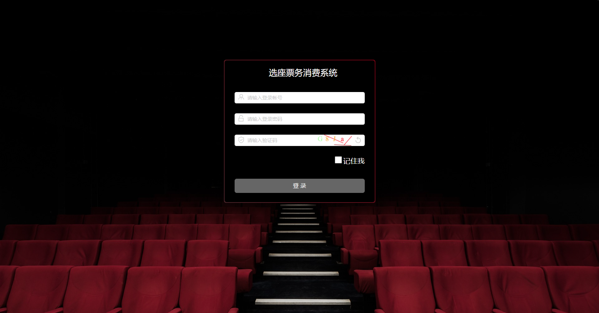
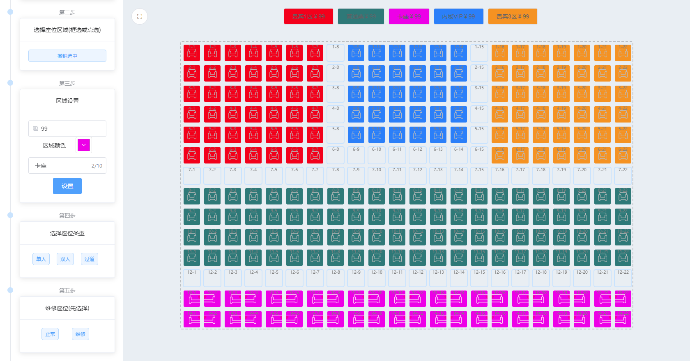
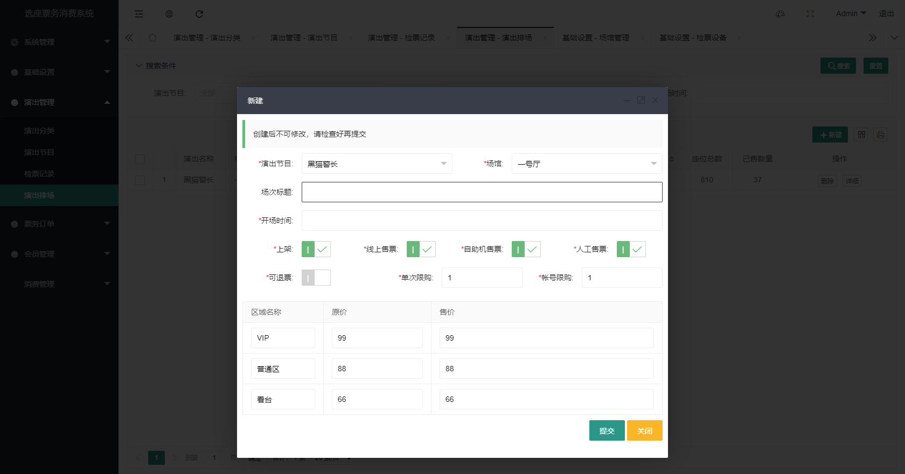
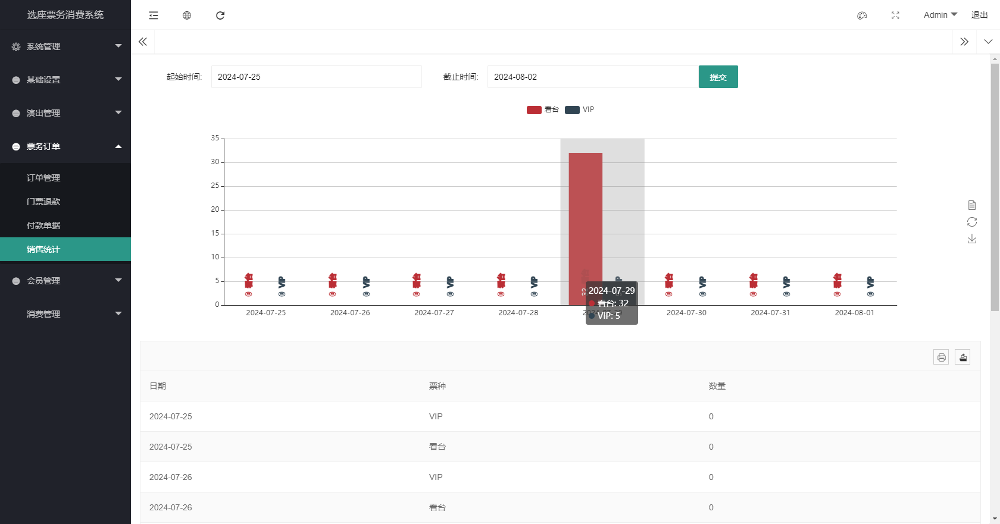
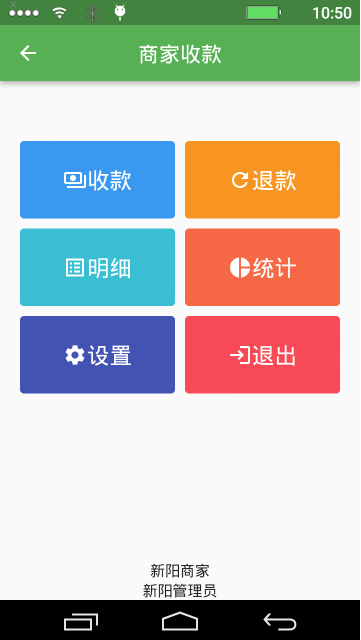
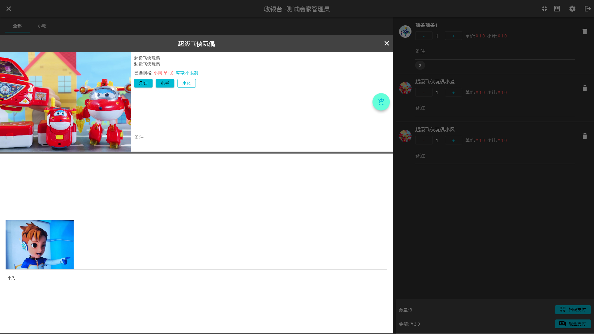

# 一个简约而不简单的选座票务消费系统

在线选座票务系统的特点：

1. 多样化场馆座位分区设计，以不同颜色区分区域门票价格，座位状态标识、座位信息实时统计；支持缩放灵活移动，便于工作人员和观众自助选座购票；可以编辑场次的名称、时间、购票注意事项等信息；支持所有场馆剧院，不同的场馆、场次、座位的价格设定；超大场馆支持，万人场馆不在话下。

2. 轻松管理节目发布上架，微信票务系统也同步座位信息，客户可以在微信端直接购票，通过关注公众号或者访问小程序端自助购票，支付成功后在订单详情内获得电子二维码凭证，不用排队取票直接刷码入场； 多渠道销售支持：OTA平台、自营小程序、自助机、人工售票。

3. 检票方式多元化闸机、手持机、人工核销，二维码一扫轻松检票，杜绝套票漏票，检票数据实时统计，可查看每场次的售票情况，以及每场次的售票明细。

4. 会员消费一卡通，最有效的获客留存的方式，会员储值消费快速便捷！多商户设计，园区内多个场馆、商户、活动，统一管理，统一消费，统一积分，统一会员，统一营销，统一数据统计。

5. 收银点单集成，简单卖货，忙中有序，不必大费周折。

>更多功能请访问官网：[众链网络](https://www.zl771.cn/)

