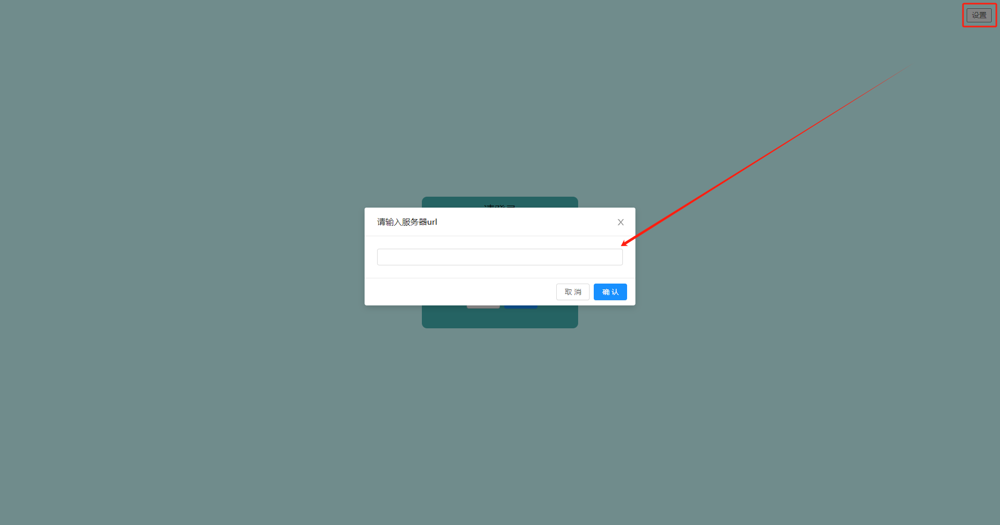
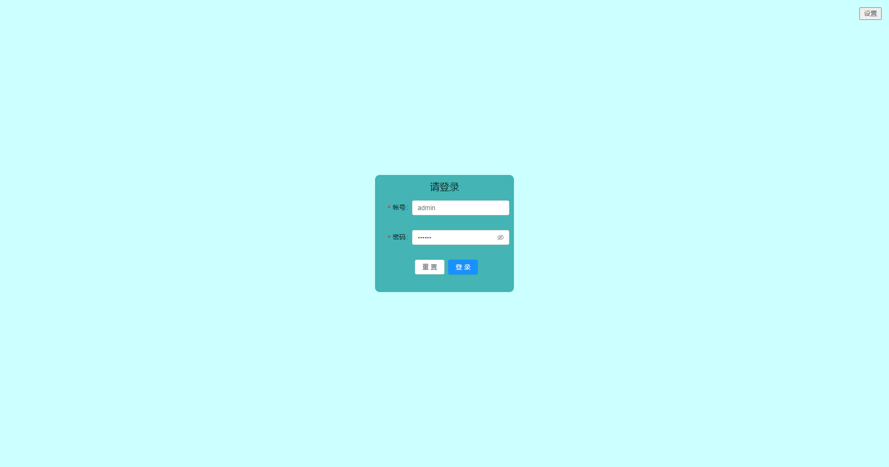
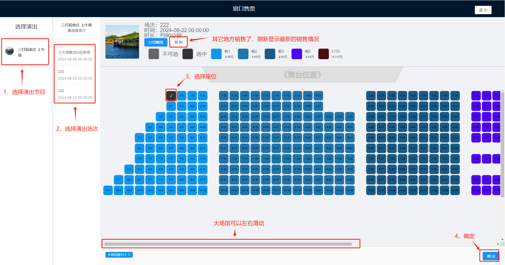
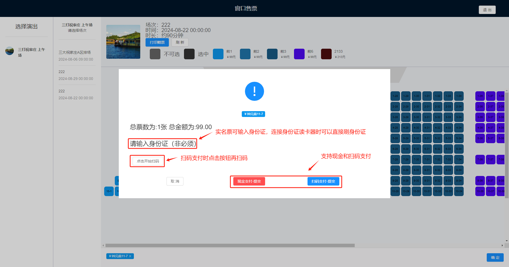

# 窗口选座售票端

> [智慧票务系统](https://www.zl771.cn)前面讲了后台如何设置演出排场，现在我们来讲解一下窗口人工售票端的使用。
窗口售票是重要的售票渠道之一，为了方便用户购票，我们提供了窗口售票端，用户可以在前台进行购票。
前台工作人员只要登陆自己的账号就可以售票。
**由于版本更新，页面上展示会有细微差异，不影响功能使用**

## 窗口售票端登录

打开窗口售票软件，设置好服务端URL后，输入账号密码登录即可。软件请联系我们的工作人员获取并安装。

## 窗口售票端程序页面操作

为了使工作人员工作效率更高，减少用户排队时间，我们使用了单页面设计，整个售票的过程都在一个页面上完成，无须跳转。

提交订单后，系统会自动打印小票，**系统内置自动重打机制，当打印机异常或缺纸时，换纸后会自动重打。**
