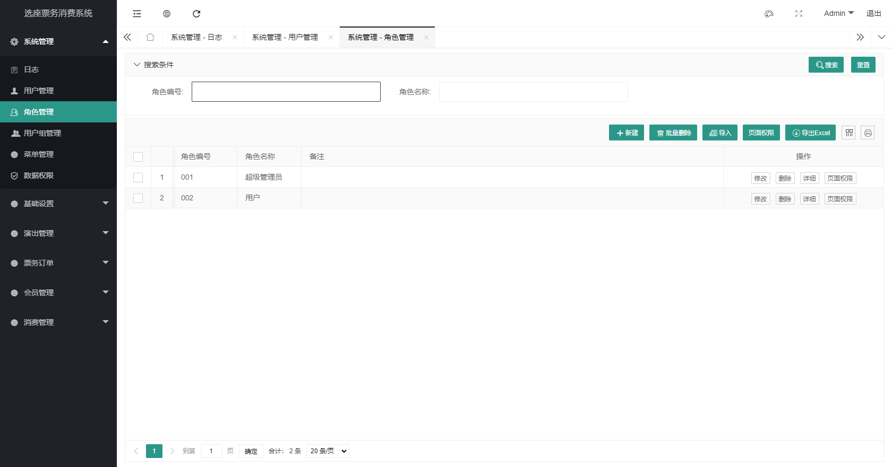
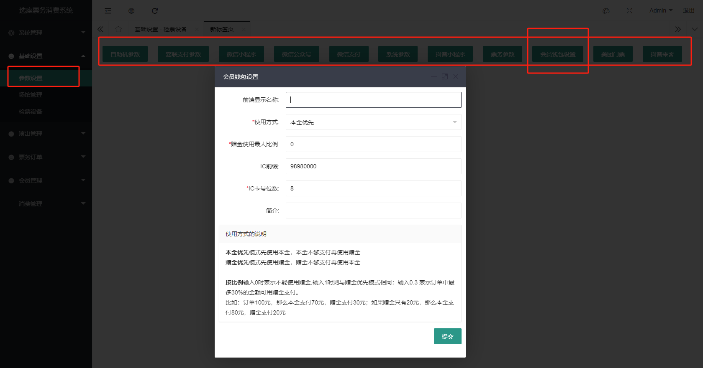
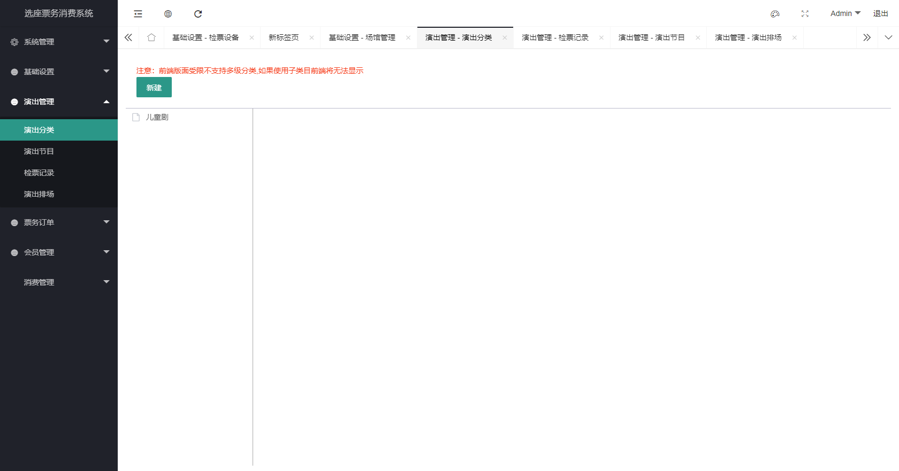
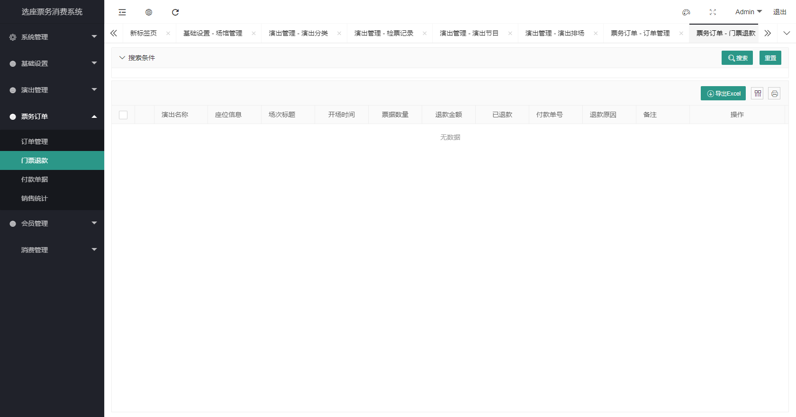
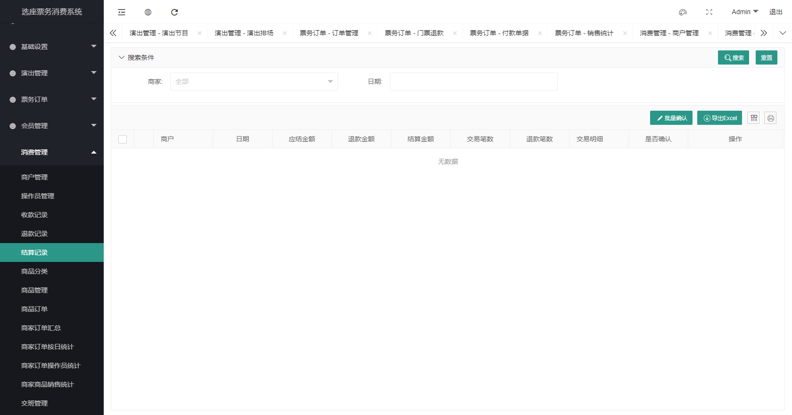

# 后台管理系统使用手册

在选座票务消费管理系统中，所有的运营管理、数据统计和用户管理都通过后台管理系统进行。在这里，你可以找到关于后台管理系统的使用说明和操作指南。

## 登录

系统部署完成后，在浏览器中输入系统地址，即可进入登录页面。输入用户名和密码后，点击登录按钮即可登录系统。

登录城后后，即可进入后台管理系统的主页面。接下来，我们将详细介绍后台管理系统的各个模块和功能。

## 系统管理

系统管理模块主要包含有日志、用户管理、角色管理、菜单管理。
>其他未介绍模块为系统扩展设计，这里不展开介绍

1. **日志**
在日志管理页，你可以查看、导出和删除系统日志，还可以通过搜索条件来过滤日志信息。是系统运维与错误排查的基本工具

2. **用户管理**
这里的用户指的是工作人员的账号管理，不包含会员用户。在这里，你可以查看、添加、修改和删除用户，为用户设定角色，也可以修改用户的密码。不过，通常我们不建议使用删除功能，而是将用户设置为禁用状态，以便保留用户的操作记录。
  

3. **角色管理**
在票务系统中，对各个用户账号的权限控制通过角色管理来实现，一个用户可以拥有多个角色身份，同时一个角色也可以包含多个用户，通过对角色页面权限的设置可以控制用户所拥有的系统功能。在这里，你可以查看、添加、修改和删除角色，为角色分配页面权限。在页面权限中，你可以勾选或取消勾选页面权限，以控制角色的权限范围。

4. **菜单管理**
菜单管理是对后台导航菜单的设置编排，默认的我们已经设置好所有的菜单，您也可以根据自己的实际情况来调整菜单，调整菜单之后需要点“刷新菜单”重新登录后才生效。**如果没有特殊需要，不建议修改菜单设置。**

## 基础设置

基础设置中包含 参数设置、场馆管理、和检票设备管理三大块。

1. **参数设置**
在这里包含各个子系统以及OTA的参数配置、一些需要特别注意的设置，我们在页面上也做了提醒，只需要按页面的指引做设置即可。**这些设置工作应该在系统初始化阶段完成，初始化完后不要随意修改，否则可能会导致系统无法正常使用。当系统不能正常使用，比如小程序无法登录、支付不成功、OTA无法正常出票，请回到这里检查各项参数设置是否正确**

2. **场馆管理**
在这里，你可以查看、添加、修改和删除场馆信息，同样的场馆也应该在系统初始化阶段就完成场馆座位的编排，在已经有演出排场的情况下，不建议修改场馆座位编排，否则会导致座位信息混乱，影响演出排场。

场馆编排方面，我们设计了可视化编排模式，点击【添加】或者【修改】按钮即可进入编排页面，在编排页面，按照步骤操作即可（第二到第六步重复操作，直到完成编排工作）。

目前我们设置的最大是60*60的座位即3600个座位，如果需要更大的座位编排，可以联系我们的技术支持，我们提供定制化的服务。**场馆编排是一个枯燥重复无味工作，稍有不留神可能会导致编排出错误的座位信息，所以在编排的时候一定要按步骤操作**

3. **检票设备管理**
在系统中，无论是手持检票机还是闸机，都统称为检票设备，在这里，你可以查看、添加、修改和删除检票设备信息，操作相对简单，这里不再赘述。**只有在系统中创建了检票设备才可以正常使用**

## 演出管理

演出管理模块是整个系统的核心模块，其流程是先添加演出分类再创建演出界面，最后添加演出排场，演出排场是整个系统中最核心的模块，所有的票务订单都是基于演出排场来生成的，所以演出排场的管理至关重要。

1. **演出分类**
演出分类是演出界面的分类，比如演唱会、音乐会、话剧、电影等，你可以在这里查看、添加、修改和删除演出分类信息，操作相对简单，这里不再赘述。

2. **演出节目**
演出节目是演出的具体节目，比如周杰伦演唱会、张学友演唱会、电影《流浪地球》等，你可以在这里查看、添加、修改和删除演出节目信息，设置演出时长、介绍、须知，操作相对简单，这里不再赘述。**创建好演出之后才可以进行排场**

3. **演出排场**
程序设置应该是简单易用的，所以演出排场的设计也是相对简单，你可以在这里查看、添加和删除演出排场信息，设置演出时间、演出状态、演出座位、演出价格。**演出排场是整个系统中最核心的模块，所有的票务订单都是基于演出排场来生成的，所以演出排场的管理至关重要** 排场的信息比较特殊，所以我们没有开放修改排场信息的功能，如果需要修改排场信息，请先删除排场，再重新添加排场。

4. **检票记录**
检票记录是用户检票的记录，你可以在这里查看检票记录信息

## 票务订单

这里包含有订单管理、退款记录、销售统计和付款单据，下面我们一一介绍

1. **订单管理**
即包含了各个渠道的订单，比如自助机、小程序、OTA、人工窗口售出的门票都会记录在这里，我们提供了简单的搜索条件，您可以使用搜索条件来过滤您想要查看的订单，同时，您也可以使用导出功能将订单导出为Excel文件，方便您进行统计和分析。

2. **退款记录**
退款记录是用户退款的信息，你可以在这里查看退款记录信息

3. **销售统计**
销售统计是销售数据的统计，你可以在这里查看销售统计信息，统计相对简单，如果您有特殊需求，可以联系我们定制开发。

4. **付款单据**
付款单据是用户付款的记录，不仅包含了演出门票的付款记录，还包含会员充值、商家收款等记录，总而言之，只要是用户付款的记录，都会记录在这里，你可以在这里查看付款单据信息

## 会员管理

会员管理是用户管理，你可以在这里查看会员信息、会员交易记录、设置会员充值规则、查看小程序授权登陆情况。

1. **充值规则**
充值是会员消费的前提，所以充值规则的管理至关重要，你可以在这里查看、添加和删除充值规则，设置充值金额、赠送金额。会员只能通过设置的规则来充值。

2. **交易记录**
在这里记录了所有的会员账变信息，每一笔交易都会记录下会员交易的金额以及交易钱的金额。当交易有纠纷或者会员数据被非法篡改可以通过记录来查询和定位。同时，我们也做了一些简单的搜索条件，方便您查询。

3. **会员列表**
会员列表是会员的信息，你可以在这里查看会员信息，包括会员的昵称、手机号、余额、积分。也可以在这里添加会员，或者扣费。

4. **第三方授权**
通常，您不需要关注这个页面，当会员数据有异常时，可以在这里手动删除其授权绑定。

## 消费管理

消费是系统的另一个核心功能，其中包含了商家收款（pos收款），商家收银（商品销售）两大块。您可以只使用其中一块的功能，也可以两块一起用。我们为此提供了常用的统计报表，如果您需要更多报表统计，可以联系我们定制开发。

1. **商户管理**
无论是商家收款、还是商家收银售卖，都需要先添加商户才可以使用。

2. **操作员管理**
操作员是商家工作人员，通常就是指销售员，他们需要登录系统来操作收银、收款。您需要为他们创建账号，并分配权限（权限分两种：普通操作员和管理员）。

3. **收款记录&退款记录**
记录商家操作员通过手持机收款的记录，以及退款记录。

4. **结算记录**
当商家通过手持机收款时，款项并不是直接进入商家的银行账户，而是进入平台的账户，系统会每天自动生成前一日的收款结算单，系统工作人员以此作为转账付款给商家的依据。**由于涉及到结算打款过程较为复杂，这里并没有自动打款给商家，需要工作人员确认后手动打款**

5. **商品分类&商品管理**
商品管理是商家收银的核心功能，您需要在这里添加商品，并设置商品的价格，以便销售员在收银时使用。

商品支持多SKU。在添加商品的时候可以添加多个SKU，如果商品本身就一个SKU那只需添加一个即可。

6. **商品订单**
这里指的是商家在收银零售端售卖的商品记录，鉴于有些商品（特产之类的）用户下单后会要求发货（谁也不希望提着一堆东西游玩吧），在后台我们提供了订单信息编辑的功能。在编辑页面可以填写收货人信息。

7. **统计汇总报表**
包含有订单汇总、按日统计、操作员统计和销售统计，具体的统计情况进入相应的页面查看即可，这里不作赘述

8. **交班管理**
操作员在【商家收银端】完成一天的工作后，退出系统做好交班则会在这里产生一条记录，同时也会打印交班单，方便管理人员查看。

以上就是后台管理系统使用介绍，说一千道一万，不如自己试试看。如果还有其他问题欢迎随时联系我们。
