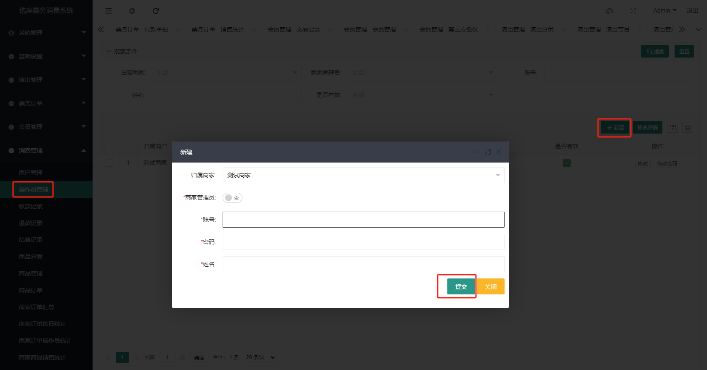
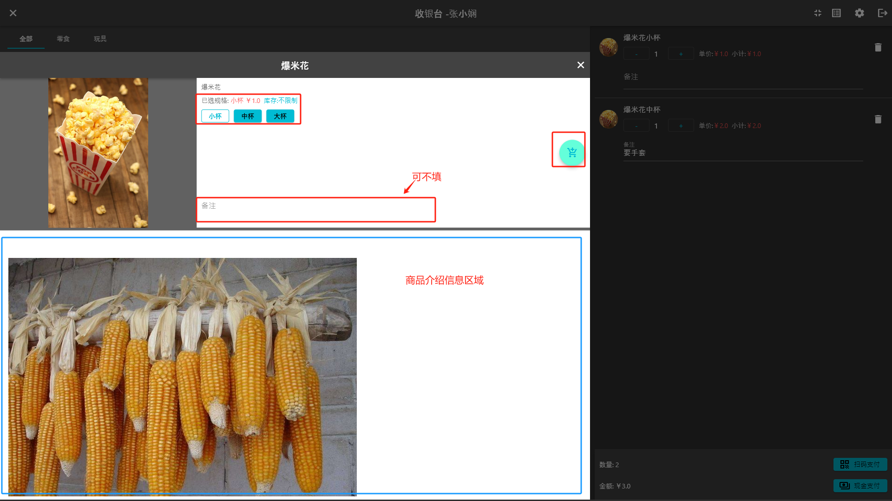
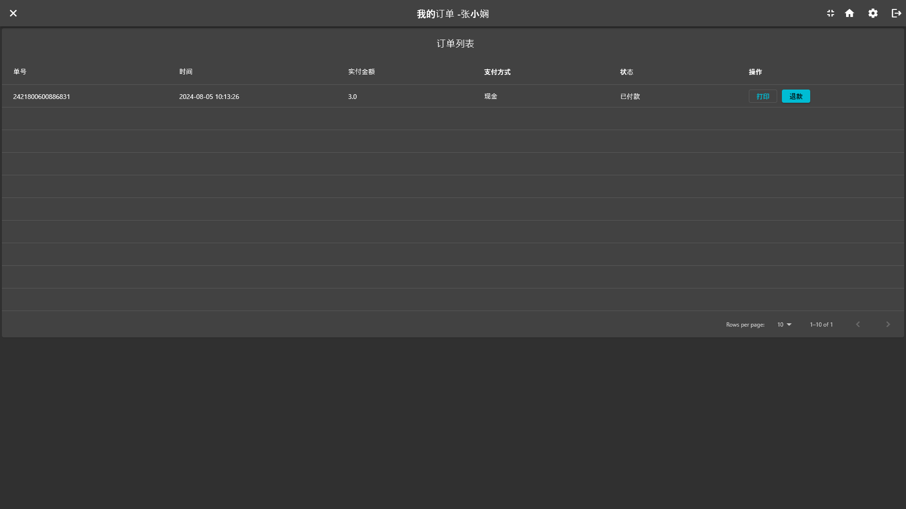
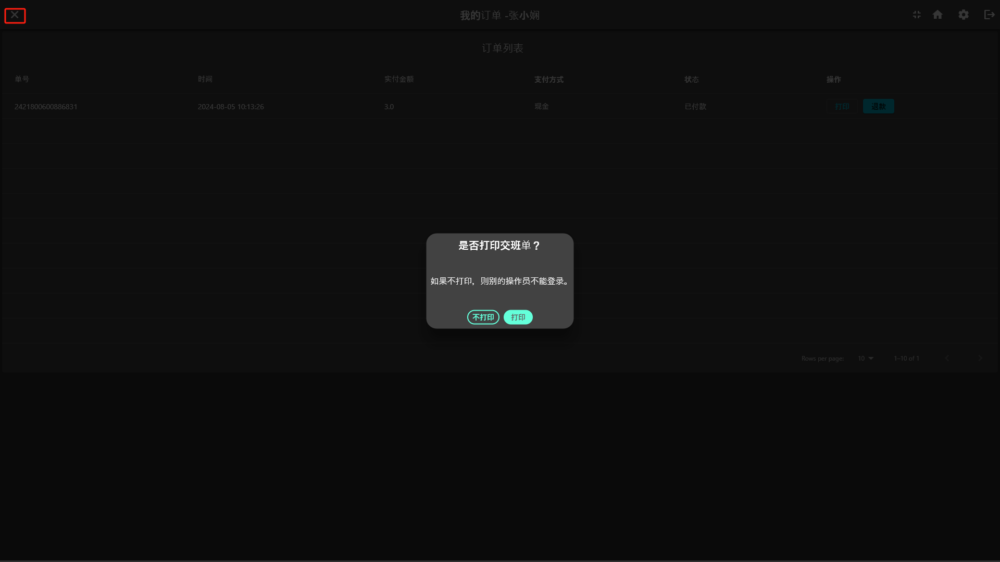

# 商家零售收银

> [智慧票务系统](https://www.zl771.cn)我们提供了一个简约的商家零售收银功能，在使用之前，需要先在管理后台创建商户、添加操作员和商品。详细使用请先阅读本篇文章。
**由于版本更新，页面上展示会有细微差异，不影响功能使用**

## 1. 商户管理

### 1.1. 创建商户

在管理后台，点击**消费管理**下的**商户管理**，点击**新建**，填写商户信息，点击**确定**。

### 1.2. 添加操作员

在管理后台，点击**消费管理**下的**操作员管理**，点击**新建**，填写操作员信息，点击**确定**。

## 2. 商品管理

### 2.1. 添加商品分类

在管理后台，点击**消费管理**下的**商品分类**，点击**新建**，填写商品信息，点击**确定**。

### 2.2. 添加商品

在管理后台，点击**消费管理**下的**商品管理**，点击**新建**，填写商品信息。

在销售信息tab页，填写销售信息，点击规格SKU列表前的**添加**，为商品添加销售规格，填写完毕后点击**确定**。

## 3. 收银台

以上步骤完成后，就可以开始使用收银台了。收银台程序请联系[智慧票务系统](https://www.zl771.cn)客服获取。

### 3.1. 打开收银台

安装好后双击程序图标打开程序，在开始使用之前须先设置服务器URL，点击右上角**设置**图标，填写服务器URL，点击**确定**。

### 3.2. 登录收银台

设置完毕后在收银台首页，输入操作员账号密码，点击**登录**。为方便下次使用，您可以勾选记住我，下次登陆就不用输入账号信息了。

### 3.3. 收银台主页面操作

点击**查看/加购**按钮后会弹出商品信息，选择要购买的规格，填写备注信息就可以加购

选好商品后，有两种收款方式，**扫码支付**和**现金支付**，扫码支付需要用扫码枪扫描用户的付款码，现金支付则直接点击**现金支付**按钮，支付完成后点击**完成**。

售票完成后，系统自动打印小票，打印机的选择与设置可以点击右上角的**齿轮**按钮设置。

### 3.4. 销售记录

点击右上角的**销售记录**图标按钮
即可进入销售记录页面，可以查看销售记录，可以点击**打印**按钮重新打印；点击**退款按钮**进行取消订单操作

### 3.5. 交班退出

点击左上角的**关闭**按钮，系统会提示是否要关闭软件，点击**确定**后，系统会提示是否需要打印交班单，如果需要打印，点击**打印**按钮，系统会自动退出；如果不打印，则其他操作员不可以登陆使用软件。

## 4. 统计报表

相关的统计报表在智慧票务系统后台可以查看，包括销售统计、商品统计、订单统计等。这里不作赘述，详细请移步登陆后台系统查看。

以上就是商家收银子系统的使用说明，祝您使用愉快、生意兴隆。
