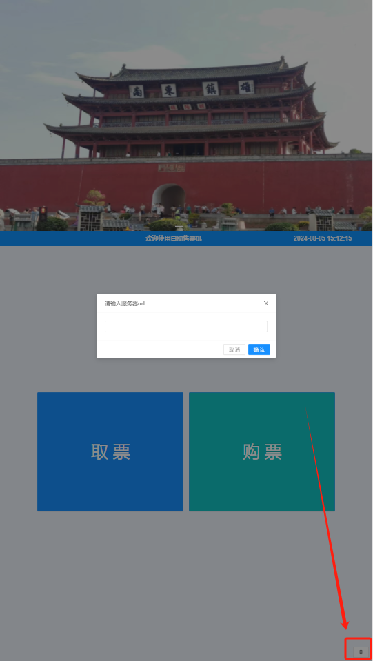

# 自助机售票端

> [智慧票务系统](https://www.zl771.cn)自助机售票端含有取票和购票的功能。通常自助机是竖屏的，所以在使用流程上会于窗口售票有些差异。
**由于版本更新，页面上展示会有细微差异，不影响功能使用**

## 1.参数设置

在使用自助机之前，先要设置服务端URL,打开自助机程序后，点击右下角的齿轮按钮，在弹出的界面中输入服务器的URL，然后点击保存即可。**为防止服务端URL被随意修改，我们设置了密码验证，请联系我们的工作人员获取设置密码**

## 2.取票

用户在其他渠道购票后，系统会生成一个取票码，用户只需要将取票码输入到自助机中，自助机会自动查询到对应的订单，并打印出票。**用户不取票直接扫电子二维码核销也是可以的**

## 3.购票

1. 用户点击购票按钮，进入购票界面，在购票页面上会展示出当前有演出的节目。

2. 用户点击想看的演出后，会进入演出详情页面，在这个页面上会展示出来演出节目的介绍、观看须知和场次排场信息。

3. 用户选择场次后，会进入座位选择页面，在这个页面上会展示出当前场次可售的座位。

4. 场馆很大时，用户可以通过滑动屏幕来查看座位信息，选好座位后点击右下角的确定按钮弹出订单确认页面。

5. 用户刷身份证、扫付款码后点击提交系统就会出票。出票成功后自动打印，**系统内置自动重打机制，当打印机异常或缺纸时，换纸后会自动重打。**
以上就是自助机购票的流程，如果遇到问题，请联系我们的工作人员。